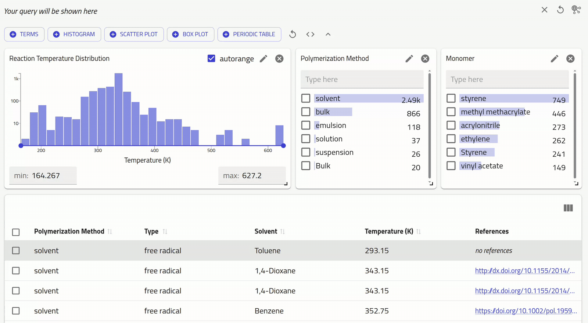

# nomad-polymerization-reactions

A NOMAD plugin providing schemas, search apps, and data transformation
utilities. The plugin has been primarily developed for hosting polymerization datasets extracted from the literature in a NOMAD deployment.

## Availability

The plugin is available on the central NOMAD deployment. You can use the
[polymerization search app][nomad-prod-polymerization-search] to
access entries from publicly available datasets. These entries
are based on the [`PolymerizationReaction`][nomad-prod-metainfo-browser] schema
defined in this plugin.

<picture>
  <source
    media="(prefers-color-scheme: dark)"
    srcset="app_dark.gif"
  >
  <source
    media="(prefers-color-scheme: light)"
    srcset="app_light.gif"
  >
  
</picture>

## Associated Work

The dataset curated using this plugin has been used in the
[`copolymer-reactivity`][copol-reactivity] project to train machine-learning
models for classifying copolymerization types.

## Installation

Install the package in your local environment with pip:

```bash
pip install nomad-polymerization-reactions
```

## Adding this plugin to NOMAD Oasis

The plugin can be added to a [NOMAD Oasis][nomad-oasis] instance in a few
steps, provided that you have access to the repository hosting the Oasis.

Read the [NOMAD plugin documentation][plugin-docs] for all details on how to
deploy the plugin on your NOMAD Oasis instance. If you want to get started with
a new Oasis, read the [installation guide][oasis-install].

## Using the CLI for data transformation

The package provides utility functions for transforming JSON files into NOMAD
entry archives. These archives have `archive.json` ending and are processed by
NOMAD once uploaded. The `m_def` key in the archives helps NOMAD to identify
which data schema to use (defined in
[schema_packages / polymerization.py][schema-packages-polymerization]).

Here's how you can convert a JSON file(s) into NOMAD entry archive(s) using the
CLI command `nomad-polymerization archive`:

```bash
# create an archive with `Monomer` schema
nomad-polymerization archive monomer.json

# create an archive with `PolymerizationReaction` schema
nomad-polymerization archive polymerization_reaction.json --mode polymerization

# provide multiple filepaths or directory paths to convert multiple JSONs
nomad-polymerization archive /folder/poly1.json /folder/poly2.json  --mode polymerization
nomad-polymerization archive /folder --mode polymerization

# By default, the command creates archives in the current working directory. To create archives
# in the same directory as the JSONs, use `same-dir` flag:
nomad-polymerization archive /folder/monomer.json --same-dir
```

The JSON files used for transformation should have a fixed format.
You can find the data models for JSON files in [models.py][models-py].

## License

Apache 2.0 - see [LICENSE][license].

[nomad-prod-polymerization-search]: https://nomad-lab.eu/prod/v1/gui/search/polymerization
[nomad-prod-metainfo-browser]: https://nomad-lab.eu/prod/v1/gui/analyze/metainfo/nomad_polymerization_reactions/section_definitions@nomad_polymerization_reactions.schema_packages.polymerization.PolymerizationReaction
[copol-reactivity]: https://github.com/lamalab-org/copolymer-reactivity/tree/main
[nomad-oasis]: https://nomad-lab.eu/prod/v1/docs/reference/glossary.html#deployment-nomad-oasis
[plugin-docs]: https://nomad-lab.eu/prod/v1/docs/howto/oasis/configure.html#plugins
[oasis-install]: https://nomad-lab.eu/prod/v1/docs/howto/oasis/install.html#how-to-install-a-nomad-oasis
[schema-packages-polymerization]: https://github.com/FAIRmat-NFDI/nomad-polymerization-reactions/blob/main/src/nomad_polymerization_reactions/schema_packages/polymerization.py
[models-py]: https://github.com/FAIRmat-NFDI/nomad-polymerization-reactions/blob/main/src/nomad_polymerization_reactions/models.py
[license]: https://github.com/FAIRmat-NFDI/nomad-polymerization-reactions/blob/main/LICENSE
