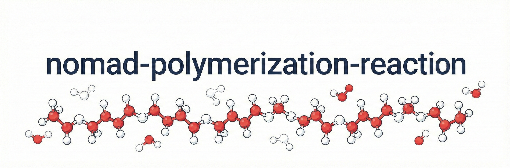

<p align="left">
 
</p>

A NOMAD plugin providing schemas, search apps, and data transformation utils for
polymerization data extracted from publications.


## Installation

Install the package in your local environment with pip:
```sh
pip install git+https://github.com/FAIRmat-NFDI/nomad-polymerization-reactions.git
```

## Adding this plugin to NOMAD Oasis

The plugin can be added to a [NOMAD Oasis](https://nomad-lab.eu/prod/v1/docs/reference/glossary.html#deployment-nomad-oasis) instance in a few steps, provided that you have access to the repository hosting the Oasis.

Read the [NOMAD plugin documentation](https://nomad-lab.eu/prod/v1/docs/howto/oasis/configure.html#plugins) for all details on how to deploy the plugin on your NOMAD instance. If you wanna get started with a new Oasis, start [here](https://nomad-lab.eu/prod/v1/docs/howto/oasis/install.html#how-to-install-a-nomad-oasis).

## Using the CLI for data transformation

The package provides utility functions for transforming JSON files into NOMAD
entry archives. These archives have `archive.json` ending and are processed by
NOMAD once uploaded. The `m_def` key in the archives helps NOMAD to identify which data schema to use.

Here's how you can convert a JSON file into an NOMAD entry archive that uses
`nomad_polymerization_reactions.schema_packages.polymerization.Monomer` schema:
```sh
nomad-polymerization archive monomer.json
```

If you want to create an archive that uses "nomad_polymerization_reactions.schema_packages.polymerization.PolymerizationReaction" schema, use the `polymerization` mode:
```sh
nomad-polymerization archive polymerization_reaction.json --mode polymerization
```

You can specify multiple filepaths in the same command or even use directory
paths. All the `.json` files in the directory will be transformed into archives:
```sh
nomad-polymerization archive /folder/polymerization/ --mode polymerization
```

By default, the command will create the archives in the same directory where it
runs. If you want to create them in the same directory as the JSON file, use
the flag `same-dir`:
```sh
nomad-polymerization archive /folder/sub-folder/monomer.json --same-dir
# creates `monomer.archive.json` file in `/folder/sub-folder/`
```

The JSON files used for transformation should have a fixed format.
You can find the data models for JSON files [here](https://github.com/FAIRmat-NFDI/nomad-polymerization-reactions/blob/main/nomad_polymerization_reactions/src/models.py).


### License
Distributed under the terms of the `Apache Software License 2.0`_ license, "nomad-nomad-polymerization-reactions" is free and open source software
